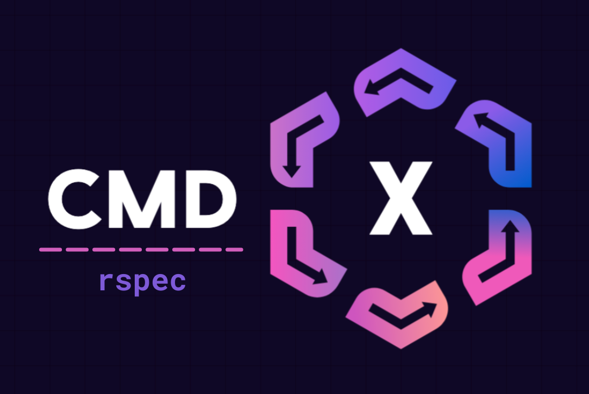

<p align="center">
  
</p>

<p align="center">
  
  
  
</p>

# CMDx::I18n

Collection of RSpec matchers for [CMDx](https://github.com/drexed/cmdx).

## Installation

Add this line to your application's Gemfile:

```ruby
gem 'cmdx-rspec'
```

And then execute:

    $ bundle

Or install it yourself as:

    $ gem install cmdx-rspec

## Usage

### have_been_success

```ruby
it "returns success" do
  result = SomeTask.execute

  expect(result).to have_been_success
end
```

### have_been_skipped

```ruby
it "returns skipped" do
  result = SomeTask.execute

  expect(result).to have_been_skipped
end
```

### have_been_failure

```ruby
it "returns failure" do
  result = SomeTask.execute

  expect(result).to have_been_failure
end
```

### have_empty_context

```ruby
it "returns empty context" do
  result = SomeTask.execute

  expect(result).to have_empty_context
end
```

### have_matching_context

```ruby
it "returns matching context" do
  result = SomeTask.execute

  expect(result).to have_matching_context(stored_result: 123)
end
```

### be_deprecated

```ruby
it "returns deprecated" do
  result = SomeTask.execute

  expect(result).to be_deprecated
end
```

## Development

After checking out the repo, run `bin/setup` to install dependencies. Then, run `rake spec` to run the tests. You can also run `bin/console` for an interactive prompt that will allow you to experiment.

To install this gem onto your local machine, run `bundle exec rake install`. To release a new version, update the version number in `version.rb`, and then run `bundle exec rake release`, which will create a git tag for the version, push git commits and the created tag, and push the `.gem` file to [rubygems.org](https://rubygems.org).

## Contributing

Bug reports and pull requests are welcome on GitHub at https://github.com/drexed/cmdx-rspec. This project is intended to be a safe, welcoming space for collaboration, and contributors are expected to adhere to the [code of conduct](https://github.com/drexed/cmdx-rspec/blob/master/CODE_OF_CONDUCT.md).

## License

The gem is available as open source under the terms of the [MIT License](https://opensource.org/licenses/MIT).

## Code of Conduct

Everyone interacting in the Cmdx::Rspec project's codebases, issue trackers, chat rooms and mailing lists is expected to follow the [code of conduct](https://github.com/drexed/cmdx-rspec/blob/master/CODE_OF_CONDUCT.md).
